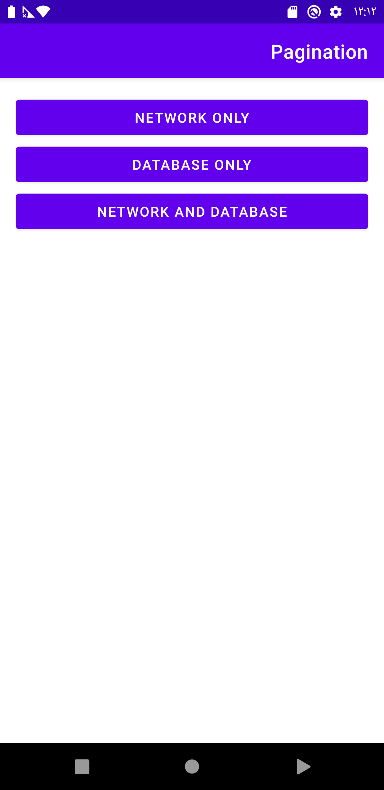

# Android Pagination Paging 3.0

The source code for [Android Pagination - Paging 3.0 course](https://www.youtube.com/playlist?list=PLbg6Nd4MUHGICER-qVejk-0knCCWLbqp5), that teaches how to use the new [paging library 3.0](https://developer.android.com/topic/libraries/architecture/paging/v3-overview) by using local database and network pagination, where the api used to paginate is [The Cat API](https://docs.thecatapi.com/pagination)

covering 3 main use cases:

- Pagination with network onlyNetworkOnlyActivity.
- Pagination with local database only DatabaseActivity.
- Pagination with network and database NetworkAndDatabaseActivity.

(Common logic is extracted to BaseCatActivity and BaseViewModel.)

------

### Libraries:

- [Retrofit](http://square.github.io/retrofit)
- [Coil](https://github.com/coil-kt/coil)
- [Room](https://developer.android.com/training/data-storage/room)
- [Hilt](https://developer.android.com/training/dependency-injection/hilt-android)
- [Coroutines](https://developer.android.com/kotlin/coroutines)
- [Paging 3.0 (rc01)](https://developer.android.com/topic/libraries/architecture/paging/v3-overview)

------

### References:

- [Android Architecture Components samples](https://github.com/android/architecture-components-samples)
- [Android Paging Codelab](https://developer.android.com/codelabs/android-paging)
- [Paging 3 library overview](https://developer.android.com/topic/libraries/architecture/paging/v3-overview)